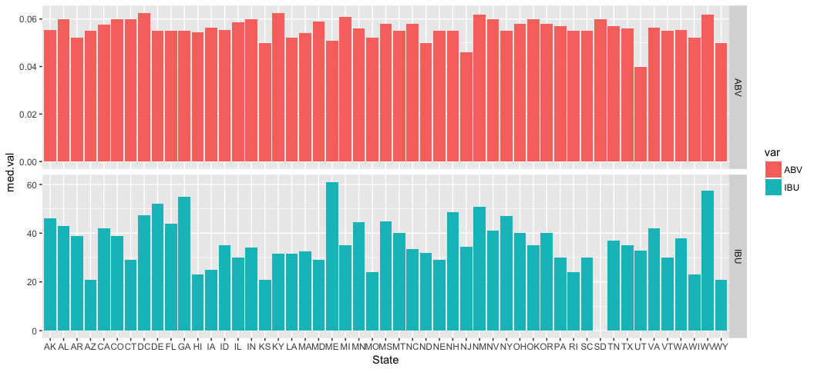
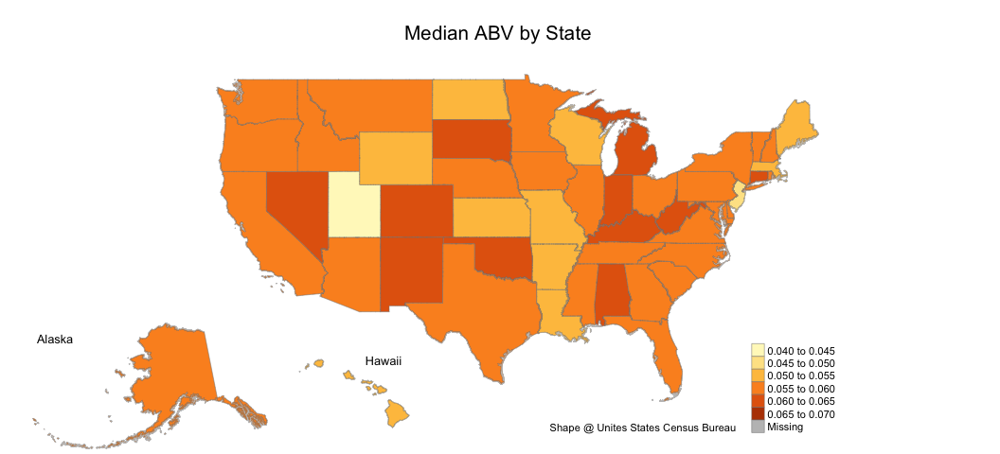
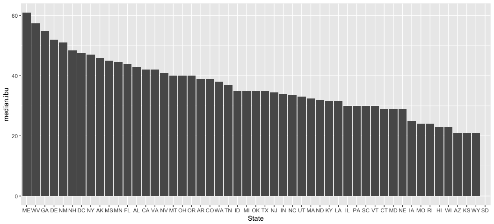
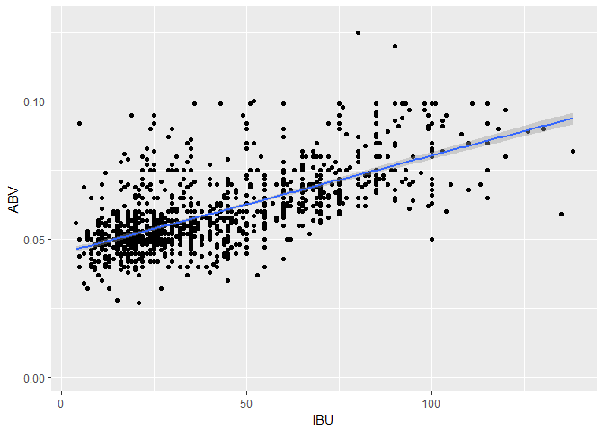

# Analysis of US Brewery Market
Brychan Manry and Patricia Goresen  
October 23, 2017  


```r
knitr::opts_chunk$set(echo = TRUE, message=FALSE)
library(dplyr)
library(kableExtra)
library(knitr)
library(ggplot2)
library(ggthemes)
library(tmap)
library(tmaptools)
library(grid)

# source custom functions
source("custom_functions.R")
```

## Ingest Data

```r
source("data_processing.R")
```

## Q1: How many breweries are present in each state?


```r
usa.states.shape@data <- usa.states.shape@data %>%
  left_join(
    breweries %>% group_by(State) %>% summarise(n_breweries = n())
  )
```

```
## Warning: Column `State` joining factor and character vector, coercing into
## character vector
```

```r
makeMap(usa.states.shape,"n_breweries", "Number of Breweries by State")
```

<!-- -->

The number of breweries in each state are shown in the table. The top five are Colorado with 47, California with 39, Michigan with 32, Oregon with 29 and Texas with 28. A full table of state brewery counts can be found [at the bottom of this report](#countTable)

## Q2: Merge data and print first and last six observations

```r
beers <- merge(beers, breweries, by.x = "Brewery_id", by.y = "Brew_ID")
```
The merged data is in a data frame called beers. The first six beers are Get Together, Maggie's Leap, Wall's End, Pumpion, Stronghold, and Parapet ESB. The last six beers are Pilsner Ukiah, Heinnieweisse Weissebier, Snapperhead IPA, Moo Thunder Stout, Porkslap Pale Ale, and Urban Wilderness Pale Ale.

## Q3: Report the number of NA's in each column

```r
colSums(is.na(beers))
```

```
##   Brewery_id    Beer_Name      Beer_ID          ABV          IBU 
##            0            0            0           62          973 
##        Style       Ounces Brewery_Name         City        State 
##            5            0            0            0            0
```
The ABV column has 62 NAs, the IBU column has 1005 NAs, and the other columns have 0 NAs.

## Q4: Compute the median alcohol content and international bitterness unit for each state. Plot a bar chart to compare

```r
# Median ABV and IBU by State Alpha
ggplot(
  bind_rows(
    beers %>% select(State, val = ABV) %>% mutate(var = "ABV"),
    beers %>% select(State, val = IBU) %>% mutate(var = "IBU")) %>%
    group_by(State, var) %>%
    summarise(med.val = median(val, na.rm = TRUE)),
  aes(x = State, fill = var, group = var)) +
  geom_bar(aes(y = med.val), stat = "identity",  position = "dodge") +
  facet_grid(var ~ ., scales = "free_y")
```

```
## Warning: Removed 1 rows containing missing values (geom_bar).
```

<!-- -->


```r
usa.states.shape@data <- usa.states.shape@data %>%
  left_join(
    beers %>% group_by(State) %>% summarise(med_abv = median(ABV, na.rm = TRUE))
  )

makeMap(usa.states.shape, "med_abv", "Median ABV by State",seq(0.04,0.07,.005))
```

<!-- -->


```r
usa.states.shape@data <- usa.states.shape@data %>%
  left_join(
    beers %>% group_by(State) %>% summarise(med_ibu = median(IBU, na.rm = TRUE))
  )
makeMap(usa.states.shape, "med_ibu", "Median IBU by State",seq(21,61,10))
```

<!-- -->

The states with the highest median ABV are the District of Columbia, Kentucky, Michigan, New Mexico, and West Virginia respectively. The states with the highest IBU are Maine, West Virginia, Florida, Georgia, and Deleware respectively.

## Q5: Which state has the maximum alcoholic beer? Which state has the most bitter beer?

```r
# Median ABV by state - ordered by median
plot.df <- beers %>% group_by(State) %>% summarise(median.abv = median(ABV, na.rm = TRUE))
plot.df$State <- factor(plot.df$State, levels = plot.df$State[order(plot.df$median.abv, decreasing = TRUE)])
ggplot(plot.df, aes(State, y = median.abv)) + geom_bar(stat = "identity")
```

<!-- -->

```r
# Median IBU by state - ordered by median
plot.df <- beers %>% group_by(State) %>% summarise(median.ibu = median(IBU, na.rm = TRUE))
plot.df$State <- factor(plot.df$State, levels = plot.df$State[order(plot.df$median.ibu, decreasing = TRUE)])
ggplot(plot.df, aes(State, y = median.ibu)) + geom_bar(stat = "identity")
```

```
## Warning: Removed 1 rows containing missing values (position_stack).
```

<!-- -->

**Looking at the State's median:** The state that has the maximum  alcoholic beers is the District of Columbia. The state that has the most bitter beers is Maine.


```r
#Maximum ABV of all States
MaxABV <- beers[which.max(beers$ABV),]
ggplot(beers, aes(x=State, y=ABV)) + geom_point(col="gray38", size=2) +geom_point(data=MaxABV, col="red2", size=2.5) + geom_text(data=MaxABV, label="Max ABV", vjust=1.4) + geom_segment(aes(x=State, xend= State, y=min(ABV), yend=max(ABV)), linetype="dashed", size=0.1) + labs(title= "ABV values for Corresponding States") + theme(axis.text.x=element_text(angle=90, hjust=1))
```

```
## Warning: Removed 62 rows containing missing values (geom_point).
```

```
## Warning: Removed 2240 rows containing missing values (geom_segment).
```

<!-- -->

```r
#Maximum IBU of all States
MaxIBU <- beers[which.max(beers$IBU),]
ggplot(beers, aes(x=State, y=IBU)) + geom_point(col="gray38", size=2) +geom_point(data=MaxIBU, col="red2", size=2.5) + geom_text(data=MaxIBU, label="Max IBU", vjust=1.4) + geom_segment(aes(x=State, xend= State, y=min(IBU), yend=max(IBU)), linetype="dashed", size=0.1) + labs(title= "IBU values for Corresponding States") + theme(axis.text.x=element_text(angle=90, hjust=1))
```

```
## Warning: Removed 973 rows containing missing values (geom_point).

## Warning: Removed 2240 rows containing missing values (geom_segment).
```

<!-- -->

**Looking at the Maximums:** The state that has the maximum  alcoholic beer is Colorado. The state that has the most bitter beer is Oregon.

## Q6: Summary statistics for the ABV

```r
summary(beers$ABV)
```

```
##    Min. 1st Qu.  Median    Mean 3rd Qu.    Max.    NA's 
## 0.00100 0.05000 0.05600 0.05987 0.06800 0.12800      62
```
The mean for the ABV variable is 0.05977 and the median is 0.056. The first quartile is 0.05 and the third quartile is 0.067 and the values range from 0.001 to 0.128 with 62 NAs.

## Q7: Is there an apparent relationship between the bitterness of the beer and its alcoholic content?

```r
ggplot(beers, aes(IBU, ABV))+
  geom_point() +
  geom_smooth(method = "lm")
```

```
## Warning: Removed 973 rows containing non-finite values (stat_smooth).
```

```
## Warning: Removed 973 rows containing missing values (geom_point).
```

<!-- -->

```r
pander::pander(summary(lm(ABV ~ IBU, data = beers)))
```


-----------------------------------------------------------------
     &nbsp;        Estimate    Std. Error   t value    Pr(>|t|)  
----------------- ----------- ------------ --------- ------------
 **(Intercept)**    0.04495    0.0005521     81.43        0      

     **IBU**       0.0003546   1.109e-05     31.98    6.111e-165 
-----------------------------------------------------------------


-------------------------------------------------------------
 Observations   Residual Std. Error   $R^2$   Adjusted $R^2$ 
-------------- --------------------- ------- ----------------
     1267             0.01021         0.447       0.4466     
-------------------------------------------------------------

Table: Fitting linear model: ABV ~ IBU

The model explains 44.93% of the variation in the ABV is explained by the IBU. As a result, there is not a strong linear relationship between ABV and IBU.

## Appendix
### State Count Table {#countTable}

```r
as.data.frame(table(breweries$State), responseName = "Number of Breweries") %>% rename(State = Var1) %>% kable()
```


State    Number.of.Breweries
------  --------------------
AK                         7
AL                         3
AR                         2
AZ                        11
CA                        39
CO                        47
CT                         8
DC                         1
DE                         2
FL                        15
GA                         7
HI                         4
IA                         5
ID                         5
IL                        18
IN                        22
KS                         3
KY                         4
LA                         5
MA                        22
MD                         7
ME                         9
MI                        32
MN                        11
MO                         9
MS                         2
MT                         9
NC                        19
ND                         1
NE                         5
NH                         3
NJ                         3
NM                         4
NV                         2
NY                        16
OH                        15
OK                         6
OR                        29
PA                        25
RI                         5
SC                         4
SD                         1
TN                         3
TX                        28
UT                         4
VA                        15
VT                         9
WA                        23
WI                        19
WV                         1
WY                         4

### Link to Github Repository
[link] (https://github.com/bmanry13/case_study_1)


